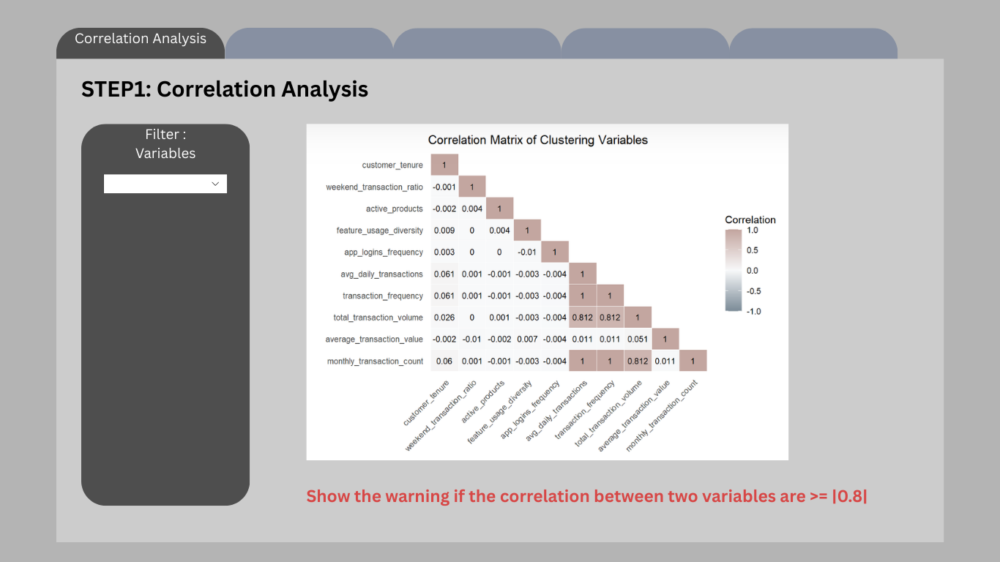
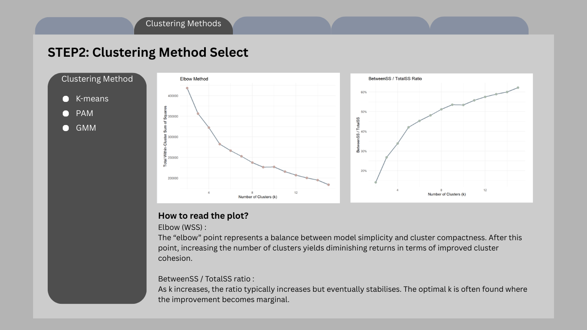
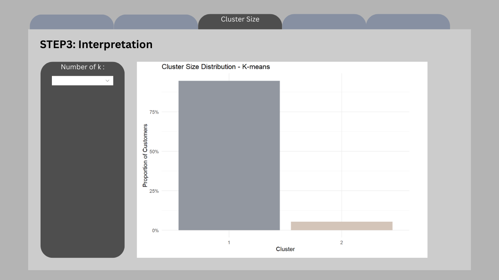
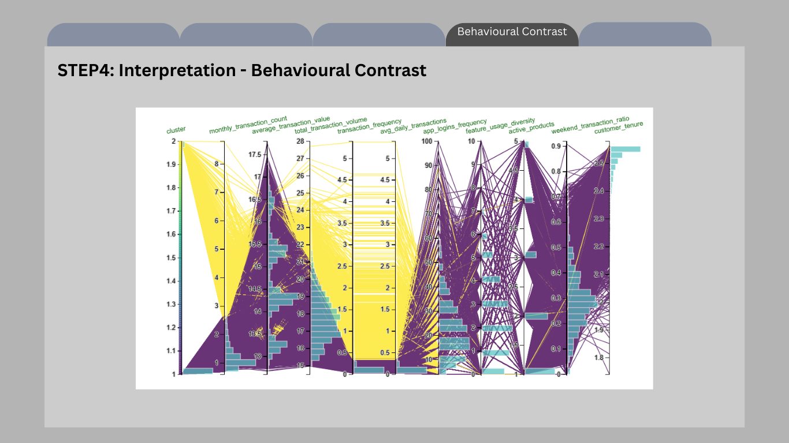
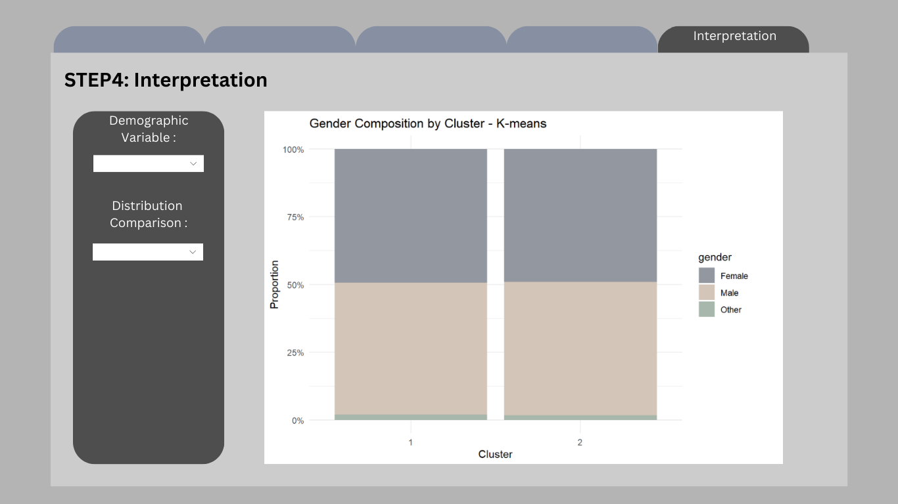

## Overview

This take-home exercise develops a prototype of the Customer Segmentation Module for the final Shiny application.

The dataset is already structured at the customer level, meaning each row represents a unique customer with demographic, behavioural, engagement, and satisfaction attributes. Therefore, no transaction-level aggregation is required.

The purpose of this prototype is to:

-   Feature engineering from transaction-level data

-   Feasibility of k-means clustering

-   Interactive parameters (k and variable selection)

-   Visual outputs for cluster exploration

## 1 Getting Started

### 1.1 Installing and loading the packages

Before performing analysis, the required packages are loaded. These packages support data manipulation, clustering evaluation, and visualisation.

| Library | Description |
|------------------------------------|------------------------------------|
| **pacman** | Install and load multiple packages in one command. |
| **tidyverse** | Data wrangling + ggplot2 visualization workflow . |
| **lubridate** | Date parsing and date arithmetic. |
| **cluster** | Clustering evaluation utilities (e.g., silhouette). |
| **factoextra** | Helper functions for visualising clusters and PCA results . |
| **DT** | Interactive tables for cluster profile summaries in Shiny. |
| **shiny** | UI and server framework for integrating this module into the final Shiny app. |
| **plotly** | Interactive plotting for cluster maps and exploratory visuals. |
| **e1071** | Skewness computation. |

```{r}
pacman::p_load(
  pacman, tidyverse, lubridate, cluster, factoextra, DT, shiny, plotly,e1071,h2o,mclust,parallelPlot
)
```

## 2 Data Preparation

### 2.1 Loading the Dataset

We first import the customer-level dataset and inspect its structure to confirm variable types.

```{r}
customers <- read_csv("data/customer_data.csv")
glimpse(customers)
```

### 2.2 Data Integrity Checks

#### 2.2.1 Missing Values

Missing values may distort clustering results. Therefore, we inspect NA counts.

```{r}
customers %>%
  summarise(across(everything(), ~sum(is.na(.))))
```

The missing value inspection shows that all 54 variables contain zero missing entries.

This indicates that the dataset is fully observed at the customer level. 
No imputation or row removal procedures are required.

#### 2.2.2 Duplicate Records

Since clustering is performed at the customer level, duplicate rows would bias the segmentation.

```{r}
sum(duplicated(customers))
```

The result indicates that no duplicate rows exist, confirming dataset integrity.

## 3 Variable Selection for Clustering

Clustering should rely on behavioural and engagement signals, rather than identifiers or pre-existing labels.

The following variables are selected:

```{r}
cluster_vars <- c(
  "monthly_transaction_count",
  "average_transaction_value",
  "total_transaction_volume",
  "transaction_frequency",
  "avg_daily_transactions",
  "app_logins_frequency",
  "feature_usage_diversity",
  "active_products",
  "weekend_transaction_ratio",
  "customer_tenure"
)
```

These variables capture:

- Transaction intensity
- Spending behaviour
- App engagement
- Product breadth
- Customer tenure

## 4 Preprocessing

Clustering results can be strongly affected by variable scale, skewness, and redundancy among features. This applies not only to K-means, but also to other clustering methods such as PAM and Gaussian Mixture Models (GMM). Therefore, preprocessing is essential to ensure fair comparison across clustering approaches.

The preprocessing pipeline follows three steps:

- Preserve original data for interpretation
- Apply transformation to highly skewed variables
- Standardise variables before clustering

### 4.1 Create Original Dataset 

Before transformation, we preserve the original numeric values. This dataset will later be used to compute cluster profile summaries.

```{r}
df_original <- customers %>%
  dplyr::select(customer_id, dplyr::all_of(cluster_vars)) %>%
  dplyr::mutate(
    dplyr::across(
      dplyr::all_of(cluster_vars),
      ~ readr::parse_number(as.character(.))
    )
  )

# Audit NA introduced by parsing
na_after_parse <- df_original %>%
  dplyr::summarise(dplyr::across(dplyr::all_of(cluster_vars), ~ sum(is.na(.)))) %>%
  tidyr::pivot_longer(dplyr::everything(), names_to = "variable", values_to = "na_n") %>%
  dplyr::arrange(dplyr::desc(na_n))

na_after_parse

# Keep complete cases for clustering variables
df_original_cc <- df_original %>%
  dplyr::filter(dplyr::if_all(dplyr::all_of(cluster_vars), ~ !is.na(.)))

# Quick sanity check
tibble::tibble(
  total_rows = nrow(df_original),
  rows_used_for_clustering = nrow(df_original_cc),
  rows_removed = nrow(df_original) - nrow(df_original_cc)
)
```

### 4.2 Correlation Analysis

Before proceeding with clustering, it is crucial to check for multicollinearity among the selected variables. Highly correlated variables can distort clustering by disproportionately weighting similar information, especially in distance-based methods such as K-means and PAM, and may also reduce interpretability in model-based clustering such as GMM.

We compute the Pearson correlation matrix and visualise it using a lower triangular heatmap.

```{r}
#| code-fold: true
#| code-summary: "Code"


cor_matrix <- cor(df_original_cc %>% select(all_of(cluster_vars)),
                  use = "pairwise.complete.obs")

cor_matrix[upper.tri(cor_matrix, diag = FALSE)] <- NA

cor_long <- as.data.frame(as.table(cor_matrix)) %>%
  rename(Variable1 = Var1, Variable2 = Var2, Correlation = Freq) %>%
  drop_na()

var_order <- colnames(cor_matrix)

cor_long$Variable1 <- factor(cor_long$Variable1, levels = rev(var_order))
cor_long$Variable2 <- factor(cor_long$Variable2, levels = var_order)

ggplot(cor_long, aes(Variable1, Variable2, fill = Correlation)) +
  geom_tile(color = "white") +
  scale_fill_gradient2(
    low = "#7B8B97",
    mid = "#F8F9FA",
    high = "#C3A6A0",
    midpoint = 0,
    limits = c(-1, 1),
    name = "Correlation"
  ) +
  geom_text(aes(label = round(Correlation, 3)), color = "black", size = 3) +
  labs(
    title = "Correlation Matrix of Clustering Variables",
    x = "", y = ""
  ) +
  theme_minimal() +
  theme(
    axis.text.x = element_text(angle = 45, hjust = 1),
    panel.grid.major = element_blank()
  )
```

:::callout-note
Shiny design note (feature selection guardrail).

In the final Shiny application, users will be allowed to select clustering variables interactively. To mitigate redundancy and distance domination in K-means, the app will automatically compute the correlation matrix for the selected variables and flag highly correlated pairs (e.g., |r| ≥ 0.8). When such cases occur, the interface will display a warning and recommend selecting only one representative variable from each highly correlated group. This guardrail improves interpretability and helps maintain balanced distance contributions across features.
:::

### 4.3 Skewness Assessment

Before applying log transformation, we quantify skewness to determine whether transformation is necessary.

```{r}
skew_table <- df_original_cc %>%
  dplyr::summarise(
    dplyr::across(
      dplyr::all_of(cluster_vars),
      ~ e1071::skewness(., na.rm = TRUE)
    )
  ) %>%
  tidyr::pivot_longer(dplyr::everything(), names_to = "variable", values_to = "skewness") %>%
  dplyr::arrange(dplyr::desc(abs(skewness)))

skew_table
```

### 4.4 Interpretation & Log Transformation

Variables with absolute `skewness > 1` are considered highly skewed and candidates for log transformation. We apply `log1p(x)` (log(1 + x)) to safely handle zero values.

```{r}
skew_vars <- skew_table %>%
  dplyr::filter(abs(skewness) > 1) %>%
  dplyr::pull(variable)

skew_vars

df_model <- df_original_cc %>%
  mutate(across(all_of(skew_vars), ~ sign(.) * log1p(abs(.))))
```

### 4.5 Skewness Comparison

To validate the effectiveness of transformation, we recompute skewness after applying log transformation.

```{r}
skew_after <- df_model %>%
  dplyr::summarise(
    dplyr::across(
      dplyr::all_of(cluster_vars),
      ~ e1071::skewness(., na.rm = TRUE)
    )
  ) %>%
  tidyr::pivot_longer(dplyr::everything(), names_to = "variable", values_to = "skew_after")

skew_compare <- skew_table %>%
  dplyr::left_join(skew_after, by = "variable") %>%
  dplyr::mutate(skew_reduction = abs(skewness) - abs(skew_after)) %>%
  dplyr::arrange(dplyr::desc(skew_reduction))

skew_compare
```

This confirms that transformation improved distribution symmetry
without over-transforming already well-behaved variables.

### 4.6 Standardisation

K-means clustering relies on Euclidean distance, which is sensitive to variable scale. We apply z-score scaling to prevent variables with larger magnitude from dominating distance computation.

```{r}
X <- df_model %>%
  dplyr::select(dplyr::all_of(cluster_vars)) %>%
  as.matrix()

sds <- apply(X, 2, sd, na.rm = TRUE)
keep_cols <- is.finite(sds) & sds > 0
X <- X[, keep_cols, drop = FALSE]

good_rows <- apply(X, 1, function(r) all(is.finite(r)))
X <- X[good_rows, , drop = FALSE]

df_id <- df_model %>%
  dplyr::select(customer_id) %>%
  dplyr::slice(which(good_rows))

df_scaled <- scale(X)

stopifnot(all(is.finite(df_scaled)))
```

## 5 Clustering Methods and Prototype Workflow

This prototype is designed to support multiple clustering methods so that users can compare segmentation outcomes under different algorithmic assumptions.

Three clustering methods are included:

- K-means: centroid-based baseline
- CLARA: medoid-based robust alternative
- GMM: model-based probabilistic alternative

This design is motivated by the fact that some behavioural variables remain highly skewed even after log transformation, and different clustering methods may respond differently to skewness, outliers, and cluster shape assumptions.

:::callout-note
In the final Shiny app, users will be able to adjust k and select variables.
This prototype demonstrates the computation workflow and the planned output components.
:::

### 5.1 K-means

K-means is used as the baseline clustering method because it is computationally efficient, widely interpretable, and integrates well with Shiny-based interactive analysis.

For full-data model selection, we use H2O K-means to evaluate candidate k values on the complete standardised matrix. H2O exposes metrics such as total within-cluster sum of squares and between-cluster sum of squares for scalable K-means training.

#### 5.1.1 Full-data K selection with H2O

```{r}
# Initialise H2O
h2o::h2o.init(nthreads = -1)
h2o::h2o.no_progress()

# Convert the full scaled matrix into an H2OFrame
h2o_X <- as.h2o(as.data.frame(df_scaled))

# Candidate k values
k_grid <- 2:15

# Run full-data H2O K-means across candidate k
k_results <- purrr::map_dfr(k_grid, function(k_val) {

  km_h2o <- h2o::h2o.kmeans(
    training_frame = h2o_X,
    k = k_val,
    standardize = FALSE,   # already standardised in Section 4
    seed = 2022
  )

  tot_withinss <- as.numeric(h2o::h2o.tot_withinss(km_h2o))
  betweenss <- as.numeric(h2o::h2o.betweenss(km_h2o))
  total_ss <- tot_withinss + betweenss

  tibble(
    k = k_val,
    tot_withinss = tot_withinss,
    betweenss = betweenss,
    between_ratio = betweenss / total_ss
  )
})

k_results
```

#### 5.1.2 Model Selection Metrics: Elbow (WSS)

Before choosing k, we inspect compactness using the Elbow Method.The metric used is **Total Within-Cluster Sum of Squares (WSS)**.
A sharp reduction followed by a flattening curve suggests diminishing returns.

::: panel-tabset
### Plot

```{r}
#| echo: false

ggplot(k_results, aes(k, tot_withinss)) +
  geom_line(color = "#7B8B97", linewidth = 1) +
  geom_point(color = "#C3A6A0", size = 3) +
  labs(
    title = "Elbow Method",
    x = "Number of Clusters (k)",
    y = "Total Within-Cluster Sum of Squares"
  ) +
  theme_minimal()
```

### Code

```{r}
#| eval: false

ggplot(k_results, aes(k, tot_withinss)) +
  geom_line(color = "#7B8B97", linewidth = 1) +
  geom_point(color = "#C3A6A0", size = 3) +
  labs(
    title = "Elbow Method",
    x = "Number of Clusters (k)",
    y = "Total Within-Cluster Sum of Squares"
  ) +
  theme_minimal()
```
:::

:::callout-note
As k increases, WSS will always decrease because more clusters reduce the distance between points and their assigned centroids. Therefore, the goal is not to minimise WSS but to identify the point where the rate of improvement slows down.

The “elbow” point represents a balance between model simplicity and cluster compactness. After this point, increasing the number of clusters yields diminishing returns in terms of improved cluster cohesion.
:::

#### 5.1.3 BetweenSS / TotalSS ratio

::: panel-tabset
### Plot

```{r}
#| echo: false

ggplot(k_results, aes(k, between_ratio)) +
  geom_line(color = "#7B8B97", linewidth = 1) +
  geom_point(color = "#A8B7AB", size = 3) +
  scale_y_continuous(labels = scales::percent_format(accuracy = 1)) +
  labs(
    title = "BetweenSS / TotalSS Ratio",
    x = "Number of Clusters (k)",
    y = "BetweenSS / TotalSS"
  ) +
  theme_minimal()
```

### Code

```{r}
#| eval: false

ggplot(k_results, aes(k, between_ratio)) +
  geom_line(color = "#7B8B97", linewidth = 1) +
  geom_point(color = "#A8B7AB", size = 3) +
  scale_y_continuous(labels = scales::percent_format(accuracy = 1)) +
  labs(
    title = "BetweenSS / TotalSS Ratio",
    x = "Number of Clusters (k)",
    y = "BetweenSS / TotalSS"
  ) +
  theme_minimal()
```
:::

:::callout-note
This ratio measures how much of the total variance in the data is explained by the clustering structure. A higher ratio indicates that clusters are more clearly separated.

As k increases, the ratio typically increases but eventually stabilises. The optimal k is often found where the improvement becomes marginal.
:::

### 5.2 CLARA

CLARA (Clustering Large Applications) is included as a large-data medoid-based alternative to K-means.

Compared with K-means, CLARA is less sensitive to extreme values because it is based on medoids rather than means. It is also more suitable than standard PAM when the dataset is large.

For CLARA, the most natural model-selection criterion is average silhouette width.

#### 5.2.1 CLARA Model Selection

```{r}
clara_results <- purrr::map_dfr(2:15, function(k_val) {
  clara_fit <- cluster::clara(df_scaled, k = k_val, samples = 5)

  tibble(
    k = k_val,
    avg_silhouette = clara_fit$silinfo$avg.width
  )
})

clara_results
```

#### 5.2.2 CLARA Plot

::: panel-tabset
### Plot

```{r}
#| echo: false

ggplot(clara_results, aes(k, avg_silhouette)) + 
  geom_line(color = "#7B8B97", linewidth = 1) +
  geom_point(color = "#C3A6A0", size = 3) +
  labs(
    title = "CLARA Score",
    x = "Number of Clusters (k)",
    y = "Average Silhouette"
  ) +
  theme_minimal()
```

### Code

```{r}
#| eval: false

ggplot(clara_results, aes(k, avg_silhouette)) +
  geom_line(color = "#7B8B97", linewidth = 1) +
  geom_point(color = "#C3A6A0", size = 3) +
  labs(
    title = "CLARA Score",
    x = "Number of Clusters (k)",
    y = "Average Silhouette"
  ) +
  theme_minimal()
```
:::

:::callout-note
For each observation, the silhouette value ranges from −1 to 1:

- Values close to 1 indicate well-separated clusters
- Values near 0 suggest overlapping clusters
- Negative values indicate potential misclassification

The average silhouette score across all observations is computed for each k. The optimal number of clusters is typically the value of k that maximises the average silhouette score.
:::

### 5.3 GMM

Gaussian Mixture Models (GMM) are included as a model-based clustering alternative.

Unlike K-means and PAM, GMM does not assume spherical clusters and instead models the data as a mixture of Gaussian components. For GMM, model selection is based on BIC rather than elbow or silhouette.

#### 5.3.1 GMM Fitting

```{r}
gmm_fit <- mclust::Mclust(df_scaled, G = 2:15)

summary(gmm_fit)
```

#### 5.3.2 GMM BIC Plot

::: panel-tabset
### Plot

```{r}
#| echo: false
#| width: 10

par(xpd = TRUE, mar = c(5, 2, 2, 13))  

plot(gmm_fit, what = "BIC", legendArgs = list(x = "right", inset = c(-0.6, 0), cex = 0.8))

par(xpd = FALSE)
```

### Code

```{r}
#| eval: false
#| width: 10

par(xpd = TRUE, mar = c(5, 4, 4, 13))  

plot(gmm_fit, what = "BIC", legendArgs = list(x = "right", inset = c(-0.6, 0), cex = 0.8))

par(xpd = FALSE)
```
:::


### 5.4 Prototype Method for Demonstration

For the remainder of this prototype, one method is selected to demonstrate downstream visual outputs.

In the final Shiny implementation, users will be able to:

- choose the clustering method
- inspect the corresponding model-selection plot
- select the final number of clusters
- compare the resulting segmentation outputs

For consistency of explanation and ease of interpretation, the downstream prototype outputs below are demonstrated using K-means with k=2.

```{r}
k_demo <- 2
method_demo <- "K-means"

set.seed(2022)
km <- kmeans(df_scaled, centers = k_demo, nstart = 50)

cluster_vector <- km$cluster

tibble(
  method_demo = method_demo,
  k_demo = k_demo,
  n_clusters = length(unique(cluster_vector))
)
```

## 6 Prototype Outputs for Shiny Integration

This section presents the common output panels that will be exposed in the final Shiny Customer Segmentation Module.

Regardless of the clustering method selected, the module will provide a consistent interpretation layer, including:

- cluster membership output
- cluster size distribution
- behavioural contrast
- key behavioural drivers
- demographic profiling
- variable-level distribution comparison

For demonstration purposes, the outputs below are generated using the selected prototype method stored in method_demo. In the final Shiny application, these panels will update dynamically according to the selected clustering algorithm.

### 6.1 Cluster Membership Output

Each customer included in the clustering workflow receives a cluster label.
To keep the downstream analysis method-agnostic, cluster assignments are stored in a generic object `cluster_vector`.

```{r}
#| code-fold: true
#| code-summary: "Code"

cluster_labels <- df_id %>%
  mutate(cluster = factor(cluster_vector))

customers_labeled <- customers %>%
  left_join(cluster_labels, by = "customer_id")

customers_clustered <- customers_labeled %>%
  filter(!is.na(cluster))

tibble(
  method_used = method_demo,
  total_customers = nrow(customers_labeled),
  clustered_customers = nrow(customers_clustered),
  excluded_customers = nrow(customers_labeled) - nrow(customers_clustered)
)
```

### 6.2 Cluster Size Distribution

Cluster size reveals whether the selected method identifies balanced segments or a smaller niche group.

```{r}
#| code-fold: true
#| code-summary: "Code"

cluster_size <- customers_clustered %>%
  dplyr::count(cluster) %>%
  dplyr::mutate(proportion = n / sum(n))

ggplot(cluster_size, aes(cluster, proportion, fill = cluster)) +
  geom_col(show.legend = FALSE) +
  scale_y_continuous(labels = scales::percent) +
  scale_fill_manual(values = c("#9297A0", "#D4C5B9", "#A8B7AB", "#C3A6A0")) +
  labs(
    title = paste("Cluster Size Distribution -", method_demo),
    x = "Cluster",
    y = "Proportion of Customers"
  ) +
  theme_minimal()
```

### 6.3 Behavioural Contrast

To understand how clusters differ behaviourally, we visualise the mean standardised profile of each cluster across the selected clustering variables.

This parallel coordinates plot shows the relative behavioural shape of each cluster rather than only the magnitude of difference.

```{r}
#| code-fold: true
#| code-summary: "Code"

pp_data <- df_model %>%
  dplyr::left_join(cluster_labels, by = "customer_id") %>%
  dplyr::filter(!is.na(cluster)) %>%
  dplyr::select(cluster, dplyr::all_of(cluster_vars))

histoVisibility <- names(pp_data)

parallelPlot::parallelPlot(
  data = pp_data,
  refColumnDim = "cluster",
  rotateTitle = TRUE,
  histoVisibility = histoVisibility
)
```


### 6.4 Key Behavioural Drivers

To avoid subjective storytelling, we rank variables by the magnitude of difference between clusters.

```{r}
#| code-fold: true
#| code-summary: "Code"

df_profile <- df_model %>%
  dplyr::left_join(cluster_labels, by = "customer_id") %>%
  dplyr::filter(!is.na(cluster))

cluster_means <- df_profile %>%
  dplyr::group_by(cluster) %>%
  dplyr::summarise(
    dplyr::across(dplyr::all_of(cluster_vars), mean),
    .groups = "drop"
  )

diff_rank <- cluster_means %>%
  tidyr::pivot_longer(
    -cluster,
    names_to = "variable",
    values_to = "mean_value"
  ) %>%
  tidyr::pivot_wider(
    names_from = cluster,
    values_from = mean_value
  ) %>%
  dplyr::mutate(abs_diff = abs(`2` - `1`)) %>%
  dplyr::arrange(dplyr::desc(abs_diff))

diff_rank %>% head(5)
```

### 6.5 Demographic Profiling

Segmentation becomes more meaningful when linked back to customer characteristics.

For this prototype, we examine whether cluster membership differs by gender.

```{r}
#| code-fold: true
#| code-summary: "Code"

gender_profile <- customers_clustered %>%
  dplyr::group_by(cluster, gender) %>%
  dplyr::summarise(n = dplyr::n(), .groups = "drop") %>%
  dplyr::group_by(cluster) %>%
  dplyr::mutate(prop = n / sum(n)) %>%
  dplyr::ungroup()

ggplot(gender_profile, aes(cluster, prop, fill = gender)) +
  geom_col(position = "fill") +
  scale_y_continuous(labels = scales::percent) +
  scale_fill_manual(values = c("#9297A0", "#D4C5B9", "#A8B7AB")) +
  labs(
    title = paste("Gender Composition by Cluster -", method_demo),
    x = "Cluster",
    y = "Proportion"
  ) +
  theme_minimal()
```

### 6.6 Distribution Comparison

To further illustrate behavioural contrast, we visualise the top-ranked variable from the driver table.

```{r}
#| code-fold: true
#| code-summary: "Code"

selected_var <- diff_rank$variable[1]

ggplot(customers_clustered,
       aes(cluster, log1p(.data[[selected_var]]), fill = cluster)) +
  geom_boxplot(show.legend = FALSE) +
  scale_fill_manual(values = c("#A8B7AB", "#C3A6A0", "#9297A0", "#D4C5B9")) +
  labs(
    title = paste("Log Distribution of", selected_var, "-", method_demo),
    x = "Cluster",
    y = "log(1 + value)"
  ) +
  theme_minimal()
```

## 7 UI Design and Prototype Storyboard

This section presents the proposed interface design for the Customer Segmentation Module in the final Shiny application.

The purpose of this design is to translate the analytical workflow developed in this prototype into an interactive interface that allows users to explore customer segmentation results dynamically.

The interface is organised into a sequential workflow consisting of four main stages:

- Variable screening through correlation analysis
- Clustering method selection and model evaluation
- Cluster structure inspection
- Behavioural and demographic interpretation

Each stage exposes a small number of interactive parameters while presenting visual outputs that support interpretation of clustering results.

### 7.1 Interface Workflow Overview

Table: Proposed workflow of the clustering module interface

| Step | Purpose | User Inputs | Visual Outputs |
|-----|-----|-----|-----|
| **Step 1** | Variable screening | Variable selector | Correlation heatmap and correlation warning |
| **Step 2** | Clustering method selection | Method selector | Model selection plots |
| **Step 3** | Cluster structure inspection | k selector | Cluster size distribution |
| **Step 4** | Behavioural comparison | None | Parallel coordinate plot |
| **Step 5** | Interpretation | Demographic selector and variable selector | Demographic composition and distribution comparison |

### 7.2 Step 1 – Correlation Analysis

The first interface panel allows users to screen the selected clustering variables using a correlation matrix.

Highly correlated variables can distort distance-based clustering methods such as K-means and CLARA by over-weighting redundant information. Therefore, correlation inspection is provided as a preliminary diagnostic step.

Users can choose which variables to include in the clustering analysis. The system then computes the Pearson correlation matrix and visualises it as a heatmap.

If the absolute correlation between two variables exceeds a predefined threshold (e.g., |r| ≥ 0.8), the interface displays a warning message recommending that users retain only one variable from the correlated pair.

```{r}
#| code-fold: true
#| code-summary: "Code"

```

Interactive controls

- Variable selection dropdown
- Automatic correlation warning system

Outputs

- Correlation heatmap
- Correlation warning message

Planned Shiny components

- `selectInput()` or `pickerInput()` for variable selection
- `plotOutput()`for correlation heatmap
- `uiOutput()` for correlation warning

### 7.3 Step 2 – Clustering Method Selection

After selecting appropriate variables, users proceed to choose a clustering algorithm.

Three clustering methods are supported:

- *K-means* 
- *CLARA* 
- *Gaussian Mixture Models (GMM)* 

For each method, a model selection plot is displayed to help users determine an appropriate number of clusters.

For example:

- K-means: Elbow plot and BetweenSS/TotalSS ratio
- CLARA: Average silhouette score
- GMM: Bayesian Information Criterion (BIC)

These plots help users identify a suitable cluster number before running the final segmentation.

```{r}
#| code-fold: true
#| code-summary: "Code"

```

Interactive controls

- Clustering method selector

Outputs

- Model selection plots corresponding to the chosen method

Planned Shiny components

- `radioButtons()` for clustering method selection
- `plotOutput()` for model selection plots

### 7.4 Step 3 – Cluster Structure Inspection

Once the clustering method has been selected, users choose the number of clusters (k).

The interface then visualises the resulting cluster size distribution.

This step allows users to inspect whether clusters are reasonably balanced or whether the solution produces extremely small niche segments.

```{r}
#| code-fold: true
#| code-summary: "Code"

```

Interactive controls

- Cluster number selector

Outputs

- Cluster size distribution bar chart

Planned Shiny components

- `sliderInput()` or `selectInput()` for k selection
- `plotOutput()` for cluster size visualisation

### 7.5 Step 4 – Behavioural Contrast

After cluster formation, the interface presents behavioural differences between clusters.

A parallel coordinates plot is used to visualise how clusters differ across multiple behavioural variables simultaneously.

This plot highlights the relative profile of each cluster rather than absolute magnitude, allowing users to identify distinct behavioural patterns.

```{r}
#| code-fold: true
#| code-summary: "Code"

```

Outputs

- Parallel coordinates plot showing behavioural differences between clusters

Planned Shiny components

- `plotOutput()` or `plotlyOutput()` for interactive parallel coordinates

### 7.6 Step 5 – Cluster Interpretation

The final panel focuses on interpreting clusters through demographic characteristics and variable distributions.

Users can explore how clusters differ across demographic variables such as gender, age group, or income category.

In addition, the interface allows users to examine distribution differences for selected behavioural variables.

```{r}
#| code-fold: true
#| code-summary: "Code"

```

Interactive controls

- Demographic variable selector
- Behavioural variable selector

Outputs

- Demographic composition chart
- Distribution comparison plot

Planned Shiny components

- `selectInput()` for demographic variable selection
- `selectInput()` for variable distribution comparison
- `plotOutput()` for visualisations